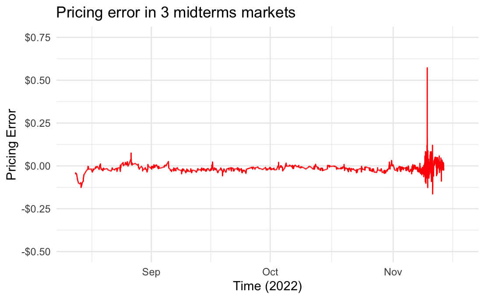

## Checking whether the markets express consistent views.

I noticed that three of the prediction markets can be linked by an arbitrage equation. There is:

1. A market for whether the House will be Democratic.
2. A market for whether the House will be Democratic *and* the Senate will be Democratic.
2. A market for whether the House will be Democratic *and* the Senate will be Republican.

Assuming that it must either be the case that the Senate is Democratic, or the Senate is Republican, we should expect the implied probability from market (1) to be equal to the implied probabilities from (2) and (3). I calculate the implied probability of (1), subtracted by (2) + (3), across time (code in R notebook):

The plot above shows that, as expected, market (1)'s implied probability is roughly equal to the sum of (2) and (3). The pricing error has mean ~0. Its variance appears to increase as more trades are placed, but adjusts quickly back to 0.

## Calculating Brier scores for each market.

The Brier score for a binary market is the average squared distance between the market estimate and the true outcome. To illustrate how Brier scores can be calculated with this data, I take the hourly prices of each market, and compare them to the market's ultimate resolution.

For example, if, at hour t, the market for the overall House prices an option paying \$1.00 if the Democrats win at \$0.50, then the corresponding Brier score for that single period is (1-0.50)^2 = 0.25. The overall Brier score for the market is the unweighted average of its Brier scores across all 1-hour periods, from the time the first trade was executed, to the time the most recent trade was executed.

hourly_unweighted_brier is a function that does just this. I use this function to produce a table with the Brier scores for each of the 39 midterms markets on Polymarket, along with each market's number of trades, trading volume, and the number of periods over which the Brier score can be calculated.

<table style="text-align:center"><caption><strong>Accuracy of Polymarket's US Midterms Predictions</strong></caption>
<tr><td colspan="6" style="border-bottom: 1px solid black"></td></tr><tr><td style="text-align:left"></td><td>Brier Score</td><td>Number of Trades</td><td>Volume (USD)</td><td>Number of Hours Open</td><td>First-Price Brier Score</td></tr>
<tr><td colspan="6" style="border-bottom: 1px solid black"></td></tr><tr><td style="text-align:left">us_senate_overall</td><td>0.422</td><td>5,087</td><td>1,774,463.000</td><td>7,315</td><td>0.152</td></tr>
<tr><td style="text-align:left">alaska_governor</td><td>0.004</td><td>41</td><td>998.920</td><td>908</td><td>0.007</td></tr>
<tr><td style="text-align:left">republican_house_and_democratic_senate</td><td>0.360</td><td>1,797</td><td>391,747.500</td><td>2,328</td><td>0.256</td></tr>
<tr><td style="text-align:left">us_house_overall</td><td>0.028</td><td>4,939</td><td>821,212.600</td><td>7,412</td><td>0.337</td></tr>
<tr><td style="text-align:left">arizona_senate</td><td>0.259</td><td>1,497</td><td>256,686.200</td><td>7,292</td><td>0.205</td></tr>
<tr><td style="text-align:left">pennsylvania_senate</td><td>0.235</td><td>1,305</td><td>181,081.800</td><td>7,223</td><td>0.236</td></tr>
<tr><td style="text-align:left">nevada_senate</td><td>0.357</td><td>1,831</td><td>179,951.900</td><td>7,315</td><td>0.205</td></tr>
<tr><td style="text-align:left">arizona_governor</td><td>0.361</td><td>1,725</td><td>127,636.400</td><td>7,358</td><td>0.233</td></tr>
<tr><td style="text-align:left">new_york_governor</td><td>0.016</td><td>617</td><td>82,000.320</td><td>517</td><td>0.121</td></tr>
<tr><td style="text-align:left">democratic_house_and_democratic_senate</td><td>0.042</td><td>1,060</td><td>55,616.070</td><td>2,328</td><td>0.244</td></tr>
<tr><td style="text-align:left">nevada_governor</td><td>0.232</td><td>414</td><td>51,717.750</td><td>7,315</td><td>0.268</td></tr>
<tr><td style="text-align:left">oregon_governor</td><td>0.212</td><td>381</td><td>49,638.070</td><td>1,260</td><td>0.520</td></tr>
<tr><td style="text-align:left">ohio_senate</td><td>0.036</td><td>464</td><td>48,601.300</td><td>4,485</td><td>0.011</td></tr>
<tr><td style="text-align:left">new_hampshire_senate</td><td>0.132</td><td>535</td><td>47,770.350</td><td>7,303</td><td>0.176</td></tr>
<tr><td style="text-align:left">colorado_senate</td><td>0.038</td><td>515</td><td>43,441.410</td><td>7,213</td><td>0.118</td></tr>
<tr><td style="text-align:left">kansas_governor</td><td>0.280</td><td>369</td><td>42,464.470</td><td>2,307</td><td>0.183</td></tr>
<tr><td style="text-align:left">michigan_governor</td><td>0.132</td><td>441</td><td>36,546.900</td><td>7,219</td><td>0.205</td></tr>
<tr><td style="text-align:left">north_carolina_senate</td><td>0.072</td><td>233</td><td>29,552.640</td><td>1,854</td><td>0.094</td></tr>
<tr><td style="text-align:left">wisconsin_governor</td><td>0.357</td><td>362</td><td>27,872.680</td><td>7,216</td><td>0.205</td></tr>
<tr><td style="text-align:left">wisconsin_senate</td><td>0.108</td><td>461</td><td>24,646.430</td><td>7,231</td><td>0.239</td></tr>
<tr><td style="text-align:left">democratic_house_and_republican_senate</td><td>0.001</td><td>458</td><td>21,055.170</td><td>2,234</td><td>0.244</td></tr>
<tr><td style="text-align:left">iowa_senate</td><td>0.006</td><td>222</td><td>12,202.830</td><td>7,212</td><td>0.345</td></tr>
<tr><td style="text-align:left">florida_senate</td><td>0.013</td><td>99</td><td>9,164.990</td><td>1,858</td><td>0.022</td></tr>
<tr><td style="text-align:left">vermont_senate</td><td>0.003</td><td>132</td><td>7,525.840</td><td>7,214</td><td>0.031</td></tr>
<tr><td style="text-align:left">washington_senate</td><td>0.018</td><td>87</td><td>7,494.440</td><td>210</td><td>0.017</td></tr>
<tr><td style="text-align:left">new_mexico_governor</td><td>0.083</td><td>223</td><td>7,267.090</td><td>7,215</td><td>0.176</td></tr>
<tr><td style="text-align:left">minnesota_governor</td><td>0.058</td><td>220</td><td>5,561.930</td><td>7,229</td><td>0.201</td></tr>
<tr><td style="text-align:left">maine_governor</td><td>0.078</td><td>144</td><td>4,823.490</td><td>7,214</td><td>0.201</td></tr>
<tr><td style="text-align:left">oklahoma_governor</td><td>0.018</td><td>159</td><td>4,472.830</td><td>517</td><td>0.183</td></tr>
<tr><td style="text-align:left">georgia_governor</td><td>0.069</td><td>181</td><td>3,466.890</td><td>7,210</td><td>0.304</td></tr>
<tr><td style="text-align:left">texas_governor</td><td>0.008</td><td>105</td><td>2,519.810</td><td>1,837</td><td>0.787</td></tr>
<tr><td style="text-align:left">florida_governor</td><td>0.004</td><td>47</td><td>1,589.480</td><td>1,201</td><td>0.828</td></tr>
<tr><td style="text-align:left">mi_07_house</td><td>0.057</td><td>93</td><td>1,439.150</td><td>986</td><td>0.046</td></tr>
<tr><td style="text-align:left">pa_07_house</td><td>0.274</td><td>64</td><td>985.630</td><td>986</td><td>0.203</td></tr>
<tr><td style="text-align:left">tx_34_house</td><td>0.089</td><td>51</td><td>879.640</td><td>937</td><td>0.043</td></tr>
<tr><td style="text-align:left">oh_09_house</td><td>0.056</td><td>35</td><td>578.860</td><td>987</td><td>0.051</td></tr>
<tr><td colspan="6" style="border-bottom: 1px solid black"></td></tr></table>

In the table above, 'First-Price Brier' is the Brier score of a hypothetical market where the first ever traded price was 'locked in' as an unchanging prediction across all periods. For markets with high liquidity, comparing the actual Brier score to the First-Price Brier is roughly asking whether the market maker, who set the initial price, was more accurate than the market itself.

## Future research

This dataset is insufficient for making inferences about the effects of volume, trading activity, etc. on prediction accuracy. Besides two markets with >$500K USD in volume, most markets were small, with few participating traders. Moreover, the markets were not opened at the same time, nor did they close at the same time, skewing my naively-estimated Brier scores.

Using similar methods, more data from different markets on Polymarket, as well as other monetized prediction platforms, could help rectify the issue. However, this would likely mean sacrificing the thematic focus of this dataset on a particular set of elections (although scraping price data from *all* politics-themed prediction markets could yield fertile grounds for research).

More broadly, some questions in this area include:

1. Are prediction markets more accurate, the more money is involved? 
2. Do very large trades (on the order of $100K+ USD) distort prediction markets in a way for which we can adjust to get more accurate probabilities?
3. How does market performance differ depending on the topic of question asked? For example, are prediction markets better at predicting inflation than election results?
4. How do market predictions compare to those of experts, such as [FiveThirtyEight](https://fivethirtyeight.com/)? How does this differ depending on the time scale over which prediction accuracy is measured (e.g., perhaps markets are worse at long-term predictions, but are better at quickly incorporating breaking news into prices)?
